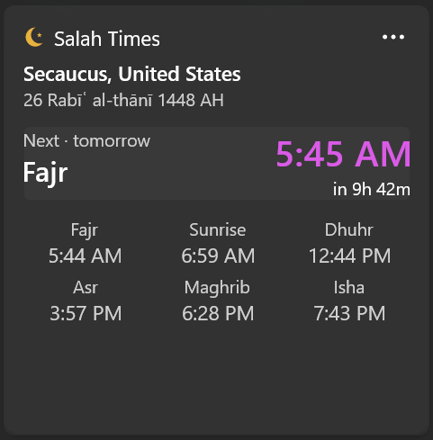
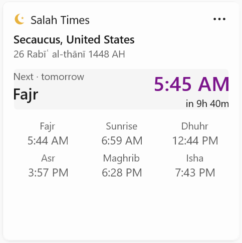
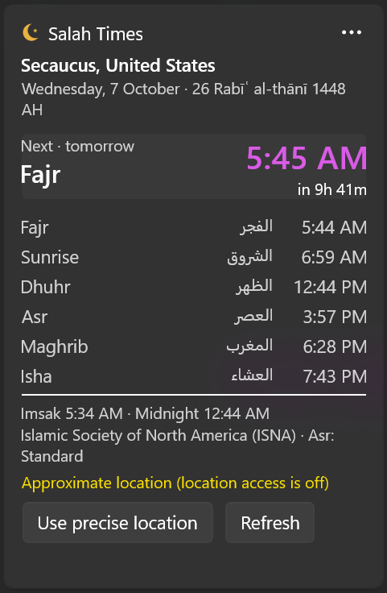
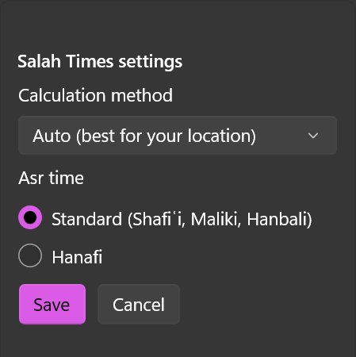

# Salah Times — Windows 11 widget

[](https://github.com/JDawg287/salah-widget/actions/workflows/ci.yml)

A widget for the Windows 11 Widgets board (<kbd>Win</kbd>+<kbd>W</kbd>). It shows today's prayer times for your current location and counts down to the next salah.

<p align="center">
  
  &nbsp;
  
</p>

> [!WARNING]
> **Install and use this software at your own risk.** It is an unofficial, community project. It is not affiliated with or endorsed by Microsoft or AlAdhan, and it is not in the Microsoft Store.
>
> - The installation steps change system settings: Developer Mode, or trusting a self-signed certificate on your machine. Only do this if you understand what it means.
> - Prayer times are *calculated*, and they can differ from your local mosque or authority. Always confirm the times that matter to you locally.
> - The software is provided "as is", without warranty of any kind (see [LICENSE](LICENSE)).

## Features

- **Location:** found the same way the Weather widget finds it. It uses Windows Location Services first. If location access is off, it falls back to an approximate IP-based location and shows a button to turn on precise location.
- **Prayer times:** from the [AlAdhan API](https://aladhan.com/prayer-times-api). The calculation method is chosen automatically for your location unless you pick one.
- **Next prayer:** shown in the accent color with a live countdown. Prayers that have passed are dimmed, and on Fridays Dhuhr is shown as *Jumuʿah*.
- **Works offline:** prayer times are cached, so the card appears instantly and still works without a connection.

| Size   | Shows |
|--------|-------|
| Small  | City, next prayer, time, and countdown |
| Medium | City and Hijri date, a next-prayer banner, and a 3×2 grid of Fajr, Sunrise, Dhuhr, Asr, Maghrib and Isha |
| Large  | Everything in Medium, plus the Gregorian date, Arabic names, Imsak and Midnight, the calculation method and Asr school, a location hint, and a Refresh button |

**Customize** (widget ⋯ menu → Customize):
- **Calculation method:** Auto, or any AlAdhan method, such as MWL, ISNA, Karachi, Umm al-Qura or Diyanet.
- **Asr time:** Standard or Hanafi.

### Screenshots

| Small | Large | Customize |
|:---:|:---:|:---:|
|  |  |  |

<sub>The location shown is approximate (IP-based), which is what the widget uses when location access is off.</sub>

## Requirements

- Windows 11 with the Widgets board.
- [.NET 8 SDK](https://dotnet.microsoft.com/download/dotnet/8.0) (`winget install Microsoft.DotNet.SDK.8`). You build the widget from source; there are no prebuilt packages.
- Windows App Runtime 1.8. It is usually already installed. If not, get it from https://aka.ms/windowsappsdk.

## Install

The widget isn't in the Microsoft Store. Windows only installs a package that is signed with a certificate it trusts, or one registered in Developer Mode. Pick **one** of the options below. Run all commands from the repository folder.

### Option A: Quick install (Developer Mode)

1. Turn on **Developer Mode**: Settings → System → For developers → Developer Mode.
2. Build and register the widget for your user:
   ```powershell
   .\scripts\Register-DevPackage.ps1
   ```

Nothing is signed and no certificate is needed. Windows runs the widget straight from the build folder (`src/SalahWidget/bin/...`), so keep that folder in place. Re-run the script after pulling changes; your pinned widgets usually stay pinned. If the package itself changed without a version bump, the script reinstalls it and you add the widget again.

### Option B: Signed install (no Developer Mode)

1. Create a signing certificate. Its private key stays in your Windows certificate store and never leaves your machine.
   ```powershell
   .\scripts\New-DevCert.ps1
   ```
2. Let Windows trust the certificate. This needs an **elevated** PowerShell (Run as administrator), once per machine. An elevated PowerShell starts in the system folder, so use the full path of the script; step 1 prints the exact command:
   ```powershell
   powershell -ExecutionPolicy Bypass -File "<path to the repository>\scripts\New-DevCert.ps1" -Trust
   ```
3. Back in a normal PowerShell, build and sign the package, then install it:
   ```powershell
   .\scripts\Build-Package.ps1
   .\scripts\Install-Package.ps1
   ```

To update later, pull the changes and run steps 3 again. Raising `Version` in `src/SalahWidget/Package.appxmanifest` upgrades the widget in place and keeps it pinned.

> [!NOTE]
> Trusting a certificate means Windows will accept *any* package signed with it. That is why the certificate is created on your own machine and its private key is never shared or committed. Don't import a certificate someone else sends you.

### Add the widget

Press <kbd>Win</kbd>+<kbd>W</kbd>, click **+** (Add widgets), and choose **Salah Times**. If it doesn't appear in the list, close and reopen the Widgets board.

### Allow precise location

Windows asks for location consent per app. Open **Settings → Privacy & security → Location**, make sure location services are on, and allow **Salah Times**. Until you do, the widget uses an approximate location based on your IP address, and says so.

### Troubleshooting

- **The widget isn't in the "Add widgets" list:** close and reopen the Widgets board. If it's still missing, sign out and back in.
- **The build fails with `PRI210: 0x800704c8 - File move failed`:** the Widgets board still has files from an earlier Developer Mode install open. Run `Get-Process WidgetBoard, WidgetService -ErrorAction SilentlyContinue | Stop-Process -Force` and build again; Windows restarts the board on demand.
- **The widget shows "Approximate location":** see [Allow precise location](#allow-precise-location).
- **Anything else:** check `%LOCALAPPDATA%\SalahWidget\widget.log` and [open an issue](../../issues).

### Uninstall

```powershell
.\scripts\Uninstall-Package.ps1                     # remove the widget, keep cached data
.\scripts\Uninstall-Package.ps1 -RemoveSettings     # also delete cached times, location and logs
.\scripts\Uninstall-Package.ps1 -RemoveCertificate  # also delete the signing certificate (run elevated to remove the machine-wide trust)
```

## Privacy

The widget has no account, analytics or telemetry. To work, it sends requests to these services:

| Service | What is sent | Why |
|---|---|---|
| [AlAdhan](https://aladhan.com) | Your coordinates | Prayer times |
| [BigDataCloud](https://www.bigdatacloud.com) | Your coordinates (precise location only) | City name |
| [ipwho.is](https://ipwho.is) / [ipapi.co](https://ipapi.co) | Your IP address (only when precise location is off) | Approximate location |

Cached data and logs are stored locally in `%LOCALAPPDATA%\SalahWidget\`.

## Development

```powershell
# Build
dotnet build src\SalahWidget -c Release -p:Platform=x64

# Unit tests (xUnit, tests/SalahWidget.Tests)
dotnet test SalahWidget.sln

# Check location + AlAdhan from the command line (no Widgets host needed)
src\SalahWidget\bin\x64\Release\net8.0-windows10.0.22621.0\win-x64\SalahWidget.exe --selftest | Out-String

# Regenerate the PNG assets
.\scripts\New-Assets.ps1
```

- **Logs:** `%LOCALAPPDATA%\SalahWidget\widget.log`. If Windows redirects the packaged app's writes, look in `%LOCALAPPDATA%\Packages\SalahWidget_*\LocalCache\Local\SalahWidget\` instead.
- **Cache:** the prayer-time cache (`prayer-cache.json`) and last location (`location.json`) are kept in the same folder.

### Project layout
```
src/SalahWidget/
  Package.appxmanifest            COM server + com.microsoft.windows.widgets app extension
  Program.cs                      COM registration (-RegisterProcessAsComServer) and --selftest
  Com/ComServer.cs                CoRegisterClassObject P/Invoke + IClassFactory
  WidgetProvider.cs               IWidgetProvider / IWidgetProvider2 (COM-visible)
  WidgetController.cs             widget state, refresh, minute ticker, idle shutdown, card rendering
  CardTemplates.cs                embedded card templates + action verbs
  Services/LocationService.cs     Geolocator → IP fallback
  Services/PrayerTimesService.cs  AlAdhan client + disk cache
  Services/WidgetDataBuilder.cs   card data (next prayer, countdown, rows)
  Templates/*.json                Adaptive Card templates (Small/Medium/Large/Customize/Message)
  Assets/                         icons + picker screenshots
tests/SalahWidget.Tests/          xUnit tests
scripts/                          install, packaging and asset scripts
.github/                          CI workflow, issue and pull request templates
```

## Credits

- Prayer times and Hijri dates: [AlAdhan](https://aladhan.com) by Islamic Network.
- Reverse geocoding: [BigDataCloud](https://www.bigdatacloud.com). IP location: [ipwho.is](https://ipwho.is) and [ipapi.co](https://ipapi.co).
- Built on the [Windows App SDK](https://github.com/microsoft/WindowsAppSDK). Its binaries are distributed under the [Microsoft Software License Terms](https://www.nuget.org/packages/Microsoft.WindowsAppSDK/1.8.260921001/License).

## Contributing and security

- Contributions are welcome. See [CONTRIBUTING.md](CONTRIBUTING.md).
- To report a security problem, see [SECURITY.md](SECURITY.md). As the installer, you are responsible for your own system.
- Changes are listed in [CHANGELOG.md](CHANGELOG.md).

## License

[MIT](LICENSE).
